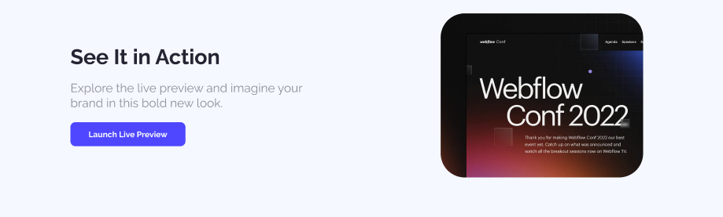
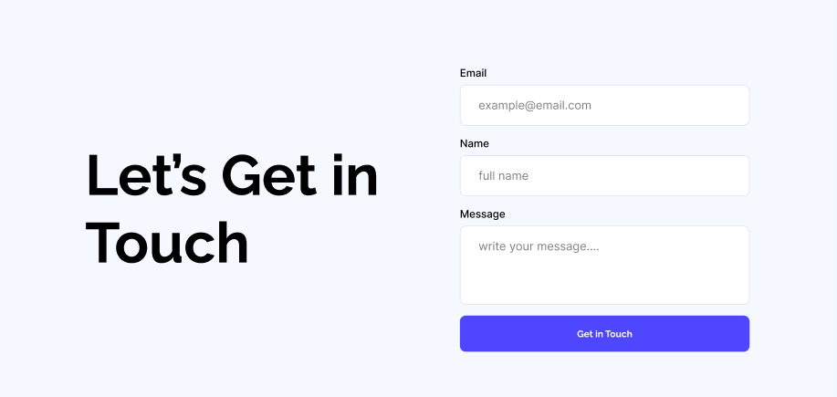

## 🌟 ASSIGNMENT-001 😎

---

## ✅ Main Requirements (Done)

### 1. Navbar Section (Done)

- **Logo/Website name** on the left.
- **Sign Up Button** on the right.

---

### 2. Banner Section (Done)

- **Heading** in the center. (3)
- **Stay Focused** button in the center. (3)

---

## 🚩 The Navbar and Banner will have an Background Image

### 3. Action Section (Done)

- Left Side:
  - Title
  - Subtitle
  - Launch Live Preview Button
- Right Side:
  - Image

---

### 4. Productive Users Section (Done)

- **Background color** to separate the section.
- **Centered title**.
- **3 data with subtitle** placed side by side.

---

### 5. Let’s Get In Touch Section (Done)

- Left Side:
  - Section Title
- Right Side:
  - Label + Input for Name, Email & Message
  - Get in Touch Button

---

### 6. Footer Section (Done)

- Centered:
  - Website name
  - Subtitle
  - Links: Home, About, How it works, Services

## 

## 🧪 CHALLENGES  (Done)

### 7. Users’ Feedback Section

- Star icon
- Title and Subtitle
- Reviewer Image, Name, and Date 

 

---

### 8. Button Animation (Done)

- Hover effect or animation on the all the buttons.

---

## ⚙️ Technology Stack

- HTML
- CSS

---

## 📌 Rules

- ✅ Minimum **5 meaningful commits** required. (Done 10 commits)

---

## 🔗 Source

- 📂 **GitHub Repository: https://github.com/alhasandhali/B12A01-landing-launchpad**
- 🌐 **Live Link: https://alhasandhali.github.io/B12A01-landing-launchpad/**

# Let's Code and Achieve my Dream 🎯
